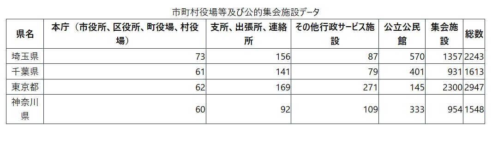
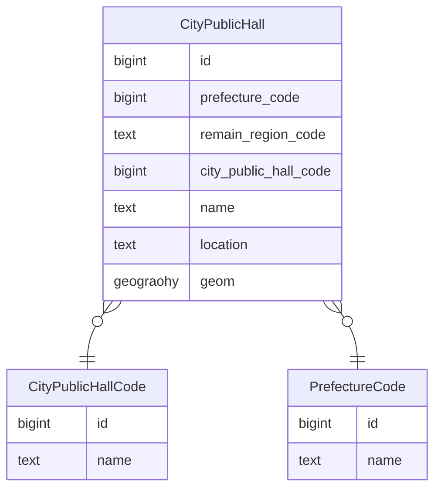

# 説明

このアプリケーションは、データを元に、以下のような単純な表で公共施設のデータを表示するものです。



# 実行

まず、`.env`ファイルを`preintern-assignment`フォルダ内に作成・またはコピーします。
(環境変数：NEXT_PUBLIC_SUPABASE_KEY, NEXT_PUBLIC_SUPABASE_URL が必要となります。)

その後、以下のコマンドで実行できます。(`preintern-assignment`フォルダ内で`dev`スクリプトを実行することもできます。)

```
$ docker-compose build
$ docker-compose up
```

アプリケーションは`localhost:80`にデプロイされます。

# バックエンドの構造

supabase上に、以下のテーブルを持つデータベースが存在することを前提にしています。



また、以下のSQL文によって構成されるビューが存在することも必要です。  
これは、公共施設を、建物の種類と県の種類ごとに分け、総数を記録しておくものです。

```sql
create view
  public.count_by_pref_and_hall_code_view as
select
  c.total,
  c.city_public_hall_code as hall_code,
  c.prefecture_code as pref_id,
  "PrefectureCode".name as pref_name
from
  (
    select
      count(*) as total,
      "CityPublicHall".prefecture_code,
      "CityPublicHall".city_public_hall_code
    from
      "CityPublicHall"
    group by
      "CityPublicHall".prefecture_code,
      "CityPublicHall".city_public_hall_code
  ) c
  join "PrefectureCode" on c.prefecture_code = "PrefectureCode".id;
```
